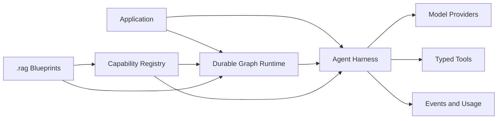
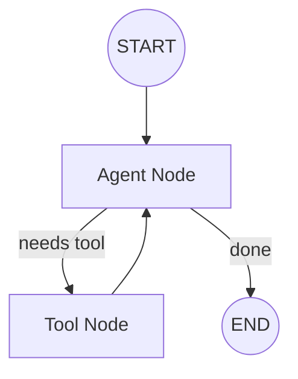

# TinyAgents

[](https://github.com/tinyhumansai/tinyagents/actions/workflows/ci.yml)
[](LICENSE)

TinyAgents is a Rust-native framework for building LLM agents as typed,
inspectable workflows.

It gives agent systems the shape production Rust teams expect: explicit state,
durable graph execution, provider-neutral model adapters, typed tools,
observable runs, and declarative workflow blueprints that can be reviewed before
they execute.

## Why TinyAgents

LLM applications should not be hidden loops of callbacks, prompt fragments, and
untracked side effects. TinyAgents makes the moving parts visible:

- typed state instead of unstructured runtime bags
- explicit graph execution instead of implicit control flow
- provider-neutral model and tool interfaces
- deterministic routing around nondeterministic model calls
- streaming, usage, and provider errors normalized at the harness boundary
- registries for models, tools, agents, graphs, stores, middleware, and policy
- `.rag` blueprints for workflows that humans and agents can inspect together

TinyAgents is early, but the foundation is already in place for durable graph
runs, harness composition, provider adapters, registry-backed capabilities, and
language-backed workflow definitions.

## Architecture





## Features

- Rust 2024 library crate with async graph and harness primitives.
- LangGraph-style durable graphs with `START`, `END`, nodes, edges,
  conditional routing, commands, checkpoints, interrupts, and topology export.
- LangChain-style harness concepts: chat models, tools, middleware, structured
  output, streaming, usage, events, retries, test doubles, and provider
  profiles.
- Standardized provider specs for OpenAI, Anthropic, Ollama, DeepSeek, Groq,
  xAI, OpenRouter, Together, Mistral, and OpenAI-compatible endpoints.
- Focused examples for local graphs, OpenAI-backed agents, tool calling,
  structured output, and model-authored `.rag` blueprints.

## Quick Setup

Until the crate is published, depend on the repository directly:

```toml
[dependencies]
tinyagents = { git = "https://github.com/tinyhumansai/rustagents" }
```

For local development:

```sh
git clone git@github.com:tinyhumansai/rustagents.git
cd rustagents
cargo test
cargo run --example basic_graph
```

For hosted providers, enable the matching feature and set provider credentials:

```sh
export OPENAI_API_KEY=...
cargo run --features openai --example openai_chat
```

For local Ollama-compatible development, run Ollama's OpenAI-compatible server
and use the provider helpers documented in the wiki.

## Documentation

The root README stays high level. Detailed examples, architecture notes,
provider setup, and workflow documentation live in the GitHub wiki:

- [Wiki home](https://github.com/tinyhumansai/tinyagents/wiki)
- [Quick start](https://github.com/tinyhumansai/tinyagents/wiki/Quick-Start)
- [Examples](https://github.com/tinyhumansai/tinyagents/wiki/Examples)
- [Providers](https://github.com/tinyhumansai/tinyagents/wiki/Providers)
- [Architecture](https://github.com/tinyhumansai/tinyagents/wiki/Architecture)
- [Graph runtime](https://github.com/tinyhumansai/tinyagents/wiki/Graph-Runtime)

The checked-in architecture specification remains available under
[`docs/spec/README.md`](docs/spec/README.md) for contributors working directly
in the repository.

## Development

```sh
cargo fmt --check
cargo clippy --all-targets -- -D warnings
cargo build --all-targets
cargo test
```

## Contributing

TinyAgents welcomes focused contributions that improve the graph runtime,
harness contracts, provider adapters, tests, examples, and documentation.

Read [CONTRIBUTING.md](CONTRIBUTING.md) before opening a pull request.

## License

TinyAgents is licensed under [GPL-3.0-only](LICENSE).

Built by TinyHumans for the Rust agent ecosystem.
